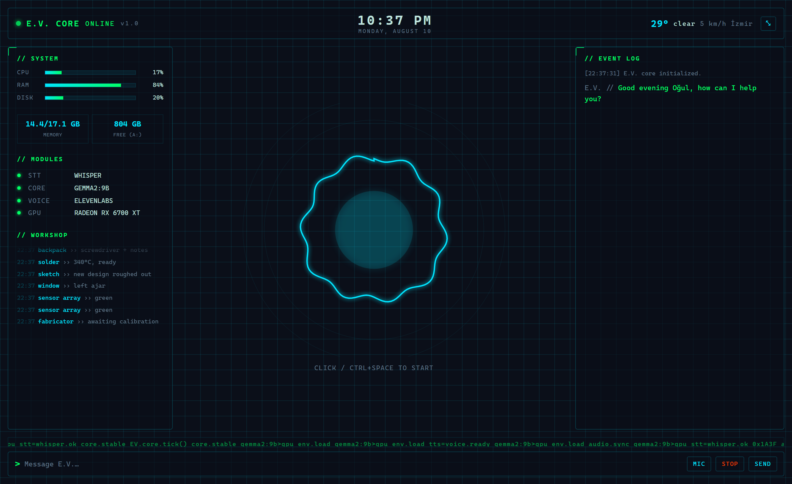
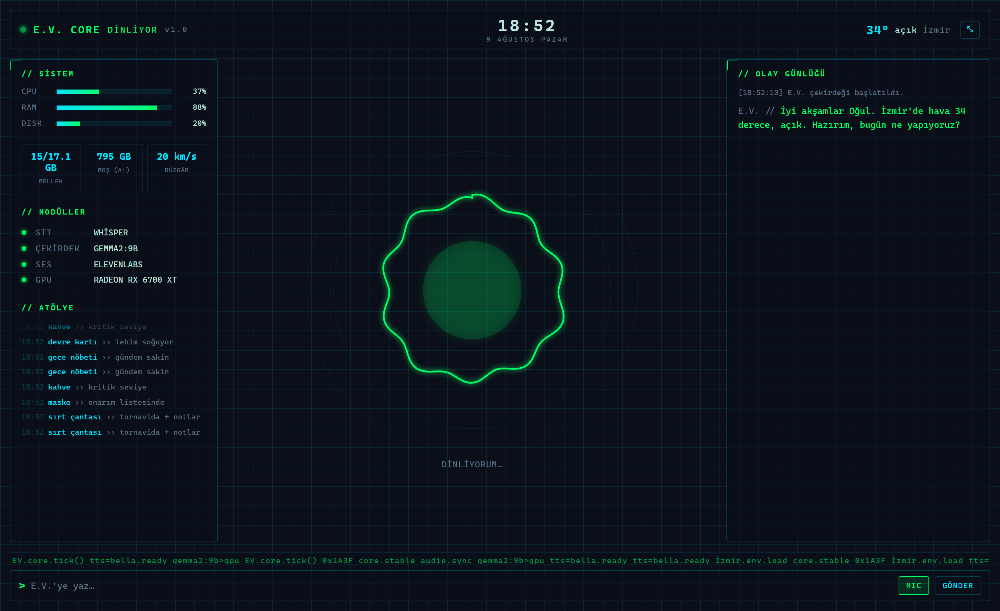

# E.V. 🕸️ — Peter Parker's homemade AI, running on *your* PC

**by [Ouru77](https://github.com/Ouru77)** · MIT License · Türkçe & English

> *A private, offline-first desktop voice assistant with a cyber "PC-dashboard" HUD — inspired by **E.V.**, the AI Peter Parker builds in Spider-Man: Brand New Day. It talks, controls your PC, and remembers you — all running locally.*



E.V. runs **entirely on your own computer**. You talk (or type), it thinks, and it answers out loud. No cloud account required, no data leaving your machine by default. The look isn't flashy Stark holograms — it's a **grid-based cyber terminal**, in the spirit of a "budget genius" workshop.

Works in **English or Turkish** out of the box. It can also **control your PC** (open/close apps, media & volume, power) and **remembers things about you** between sessions.

*(Türkçe açıklama için [aşağıya bak](#türkçe).)*

---

## ✨ Features

- 🎙️ **Talk to it** — local **Whisper** speech recognition (offline, free). English or Turkish.
- 🧠 **Local brain** — a local LLM via **[Ollama](https://ollama.com)** (default `gemma2:9b`). Optionally plug in Claude for a smarter brain.
- 🔊 **Speaks back** — your browser's built-in voice (free) or **ElevenLabs** for a natural voice.
- 🖥️ **Cyber HUD** — an Electron desktop app: a compact corner **orb** or a full **dashboard** (system stats, clock, weather, live audio waveform, event log, terminal input).
- 🎛️ **Live audio core** — a circular visualizer that reacts to **your mic** while listening and to **E.V.'s voice** while speaking.
- 💻 **PC control** — "open Spotify", "turn it up", "next track", "lock the screen", "close Chrome", plus **mouse** clicks and scrolling. Destructive actions (closing apps, shutdown, running commands) **ask for confirmation first**.
- 📺 **Play by name** — "play *Enter Sandman* on YouTube" → E.V. finds and opens the video in your browser.
- 🫥 **Auto-tray on fullscreen** — start a game or fullscreen video and E.V. quietly drops to the tray, then comes back when you're done.
- 🧠 **Long-term memory** — "remember that my favorite color is green" → E.V. recalls it in future sessions. "forget my coffee preference" clears it.
- 🙂 **Honest** — if you ask for something it can't do, it says so instead of pretending — and suggests an alternative.
- 💬 **Conversation mode** — once you enable listening it stays in the conversation, then auto-mutes after a stretch of silence (safe while gaming).
- 👁️ **Screen vision** — "what do you see on my screen?" — describes what's open. *(Requires a Claude API key — see below.)*
- 🌐 **Web** — web search and opening pages (Playwright).
- 🔒 **Private** — with the default setup, nothing goes to the cloud; everything is local, and the server binds to `127.0.0.1` only.
- 🔕 **Safe listening** — muted by default; toggle with `Ctrl+Space` so it never listens by accident.

### 🔑 What needs an API key?

E.V. is **fully functional for free** — talking, the local brain, PC control, memory, YouTube, and the HUD all work with **no keys** (Ollama + Whisper + browser voice). Two things are optional upgrades that **do** need a key:

| Feature | Works out of the box? | Needs a key |
|---|---|---|
| Voice chat, PC control, memory, YouTube, HUD | ✅ Free, no key | — |
| **Screen vision** ("what's on my screen?") | ❌ | **Claude API key** (`anthropic`, used for image understanding) |
| Natural ElevenLabs voice (instead of browser voice) | ❌ (browser voice is the free default) | ElevenLabs key |
| Claude as the main brain (instead of local Ollama) | ❌ (Ollama is the free default) | Claude API key |

> Get a Claude key at [console.anthropic.com](https://console.anthropic.com); set `llm_provider: "anthropic"` for the brain, and a key is also what powers **screen vision**.

## 🧩 Architecture

```
Mic → Whisper (STT, local) → FastAPI server
                                  │
                     command router (PC / memory) ─── deterministic, pre-LLM
                                  │
                            Ollama (LLM, local/GPU)
                                  │
        ┌─────────────────────────┼───────────────────────┐
   ElevenLabs / Browser       Playwright              Screen capture
        (TTS)                  (browser)               (optional)
                                  │
                    Electron HUD (WebSocket) ←→ browser
```

- **Backend:** Python + FastAPI + WebSocket (`server.py`)
- **STT:** `faster-whisper` (local, CPU)
- **LLM:** Ollama (local) or Anthropic Claude (optional)
- **TTS:** ElevenLabs or the browser Web Speech API
- **UI:** Electron + HTML/CSS/JS (`electron/`, `frontend/`)

## 🖥️ Requirements

- **OS:** Windows 10/11 — PC control, screen capture, media keys, fullscreen auto-tray and the launcher are Windows-specific.
- **Python** 3.10+ · **[Ollama](https://ollama.com)** (local brain) · **Node.js** (only for the Electron desktop app).
- **GPU / VRAM:** the default `gemma2:9b` needs **~7–8 GB VRAM** (Q4) and runs fully on an **8 GB+** GPU (I'm on an RX 6700 XT 12 GB, ~37 tok/s). On a smaller card, swap in a **3B** model (`llama3.2:3b`, `qwen2.5:3b`) for **~2–4 GB**, or run **CPU-only** (slower).
- **STT & TTS add no VRAM:** Whisper runs on the **CPU**; voice is ElevenLabs/browser (not local).
- **RAM:** 16 GB is comfortable.
- **Free by default** — no API keys needed (Ollama + Whisper + browser voice). Claude for screen vision and ElevenLabs for a nicer voice are optional.

## 🚀 Setup

```bash
# 1) Python dependencies
pip install -r requirements.txt
playwright install chromium

# 2) Local model (Ollama)
ollama pull gemma2:9b

# 3) Configuration
#    copy config.example.json  ->  config.json  and edit it.
#    Defaults are 100% free/local: Ollama + Whisper + browser voice. No keys needed.

# 4) Run
python server.py
#    Open http://localhost:8340 in a browser.
```

**Desktop app (Electron HUD):**

```bash
npm install
npm start
```

### Make it yours — `config.json`

The important bits:

```jsonc
{
  "language": "en",          // "en" (English) or "tr" (Türkçe)
  "user_name": "YOUR NAME",  // E.V. addresses you by this — so it won't say someone else's name 🙂
  "user_address": "YOUR NAME",
  "city": "London",          // used for the weather line

  "pc_control": true,        // allow open/close apps, media, power (with confirmation)
  "conversation_mode": true, // stay listening between turns, auto-mute when idle

  "tts_provider": "browser", // "browser" (free) or "elevenlabs"
  "llm_provider": "ollama"   // "ollama" (local) or "anthropic"
}
```

> 🗣️ **Important:** set `user_name` to *your* name. That's the name E.V. greets you with — otherwise it just uses a placeholder.

> Nicer voice: grab a free key from [elevenlabs.io](https://elevenlabs.io), put it in `config.json`, set `tts_provider` to `"elevenlabs"` and pick a `elevenlabs_voice_id`.
> Smarter brain: get a key from [console.anthropic.com](https://console.anthropic.com) and set `llm_provider` to `"anthropic"`.

## 🎮 How to use

1. Launch the app (or open `http://localhost:8340`).
2. Press **`Ctrl+Space`** (or click the core) to start listening — it's muted by default.
3. Talk. E.V. transcribes, thinks, and answers out loud.
4. Try things like:
   - *"What can you do?"*
   - *"Open the calculator."* · *"Close Chrome."* (asks to confirm)
   - *"Turn it up."* · *"Next track."* · *"Lock the screen."* (asks to confirm)
   - *"Remember that I take my coffee black."* → later: *"How do I take my coffee?"*

## 📁 Layout

```
server.py            FastAPI server (STT / LLM / TTS orchestration)
command_router.py    Deterministic TR/EN command routing (PC control + memory)
pc_control.py        Windows control: launch apps, media keys, power
strings.py           Bilingual (tr/en) prompts and spoken lines
whisper_stt.py       Local Whisper speech recognition
browser_tools.py     Playwright browser control
screen_capture.py    Screen description (optional)
frontend/            The UI (HUD + dashboard)
electron/            Desktop app shell
config.example.json  Example config (copy -> config.json)
```

## 🙏 Credits

Started from Julian Ivanov's [`jarvis-voice-assistant`](https://github.com/Julian-Ivanov/jarvis-voice-assistant) template, then substantially rewritten: E.V. identity, a fully-local (Ollama + Whisper) stack, the cyber dashboard, English/Turkish support, deterministic PC control, and long-term memory.

Character inspiration: *Spider-Man: Brand New Day* (E.V., voiced by Naomi Watts). This is a fan project, not affiliated with Marvel or Sony.

> Built by **[Ouru77](https://github.com/Ouru77)**. If you use or build on E.V., keeping the MIT notice is required — and a link back is genuinely appreciated. 🙏

## 📜 License

[MIT](LICENSE) — do what you like, just keep the notice. See the LICENSE file for the template credit and fan-project note.

---

<a name="türkçe"></a>
# 🇹🇷 E.V. — Kendi bilgisayarında çalışan sesli asistan

E.V., tamamen **kendi bilgisayarında** çalışan, gizliliğe önem veren bir sesli asistandır. Konuşursun ya da yazarsın; anlar, düşünür ve sesle cevap verir. Arayüzü gösterişli hologramlar değil, **grid tabanlı siber bir terminal** — Peter'ın atölyesindeki "bütçesiz ama dahi" havasında. **Türkçe ve İngilizce** çalışır; ayrıca **bilgisayarını kontrol edebilir** (uygulama aç/kapat, ses/müzik, güç) ve **seninle ilgili şeyleri hatırlar**.

İsim ve karakter, *Spider-Man: Brand New Day*'deki Peter Parker'ın kendi yaptığı asistan **E.V.**'den esinlenir: sakin, zeki, mucit ruhlu.



## ✨ Özellikler

- 🎙️ **Sesle konuş** — yerel **Whisper** (offline, ücretsiz), Türkçe ya da İngilizce.
- 🧠 **Yerel beyin** — **Ollama** üzerinde yerel LLM (varsayılan `gemma2:9b`). İstersen Claude'a bağlanır.
- 🔊 **Sesli cevap** — tarayıcının yerleşik sesi (ücretsiz) ya da **ElevenLabs**.
- 🖥️ **Siber HUD** — Electron uygulaması: köşede kompakt **orb**, tam ekranda **dashboard**.
- 💻 **PC kontrolü** — "spotify aç", "sesi aç", "sonraki şarkı", "ekranı kilitle", "chrome'u kapat", ayrıca **fare** tıkla/kaydır. Yıkıcı işlemler (kapatma, güç, komut) **önce onay ister**.
- 📺 **İsimle aç** — "YouTube'da Enter Sandman aç" → videoyu bulup tarayıcında açar.
- 🫥 **Tam ekranda otomatik tray** — oyun/tam ekran video açınca E.V. sessizce tepsiye çekilir, çıkınca döner.
- 🧠 **Kalıcı hafıza** — "en sevdiğim rengi hatırla, yeşil" → sonraki oturumlarda hatırlar. "kahve tercihimi unut" ile siler.
- 🙂 **Dürüst** — yapamayacağı bir şeyi "yapıyorum" diye uydurmaz; dürüstçe söyler ve varsa alternatif önerir.
- 💬 **Sohbet modu** — dinlemeyi açınca sohbette kalır, bir süre sessizlikte otomatik susar (oyun sırasında güvenli).
- 👁️ **Ekranı görme** — "ekranda ne görüyorsun?" — açık olanları betimler. *(Claude API anahtarı gerekir.)*
- 🔒 **Gizli** — varsayılanda hiçbir şey buluta gitmez; sunucu yalnızca `127.0.0.1`'e bağlanır.
- 🔕 **Güvenli dinleme** — varsayılan sessiz; `Ctrl+Space` ile açılır.

> 🔑 **Anahtar gerektirenler:** Konuşma, PC kontrolü, hafıza, YouTube ve HUD **tamamen ücretsiz** çalışır (Ollama + Whisper + tarayıcı sesi, anahtar gerekmez). Yalnızca **ekranı görme** için Claude anahtarı, doğal **ElevenLabs sesi** için ElevenLabs anahtarı, beyin olarak **Claude** için Claude anahtarı gerekir.

## 🖥️ Gereksinimler

- **İşletim sistemi:** Windows 10/11 (PC kontrolü, ekran yakalama, medya tuşları ve tam ekran algısı Windows'a özel).
- **Python** 3.10+ · **[Ollama](https://ollama.com)** · **Node.js** (yalnızca masaüstü uygulaması için).
- **GPU / VRAM:** varsayılan `gemma2:9b` **~7–8 GB VRAM** ister (Q4), **8 GB+** kartta tamamen GPU'da çalışır. Küçük kartta **3B** model (`llama3.2:3b`, `qwen2.5:3b`) ile ~2–4 GB, ya da sadece CPU (daha yavaş).
- Whisper **CPU'da** çalışır, ses ElevenLabs/tarayıcı — yani **ses için yerel VRAM gerekmez**.
- **Varsayılanda ücretsiz** — anahtar gerekmez.

## 🚀 Kurulum

```bash
pip install -r requirements.txt
playwright install chromium
ollama pull gemma2:9b
# config.example.json -> config.json (kopyala, düzenle; language: "tr")
python server.py            # http://localhost:8340
# Masaüstü uygulaması:
npm install && npm start
```

> `config.json` içinde `user_name` alanına **kendi adını** yaz — E.V. seni bu isimle selamlar. `language`'ı `"tr"` yap.
> Daha iyi ses için [elevenlabs.io](https://elevenlabs.io); Claude beyni için [console.anthropic.com](https://console.anthropic.com).

## 🙏 Teşekkür

[Julian Ivanov'un `jarvis-voice-assistant`](https://github.com/Julian-Ivanov/jarvis-voice-assistant) şablonu temel alınmış; ardından E.V. kimliği, yerel (Ollama + Whisper) yığın, siber dashboard, Türkçe/İngilizce destek, PC kontrolü ve hafıza eklenerek yeniden yazılmıştır. Karakter ilhamı: *Spider-Man: Brand New Day*. Bu bir hayran projesidir; Marvel/Sony ile bağlantısı yoktur.

## 📜 Lisans

[MIT](LICENSE).

---

<p align="center"><sub>Made with 🛠️ by <a href="https://github.com/Ouru77">Ouru77</a> — E.V. // ONLINE</sub></p>
